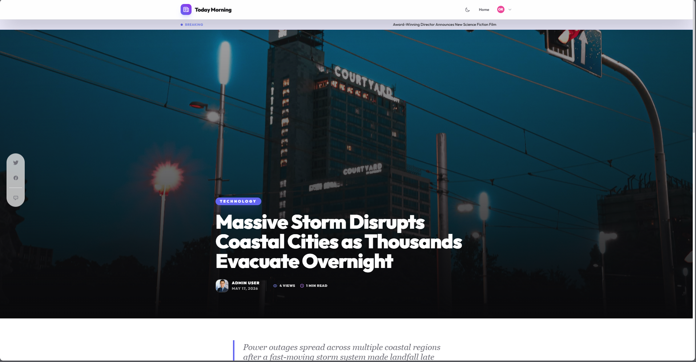
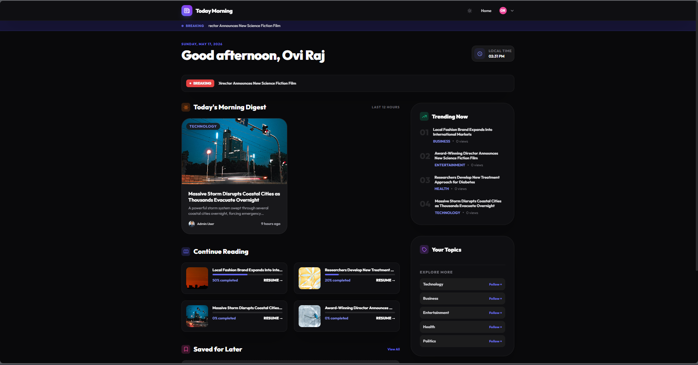
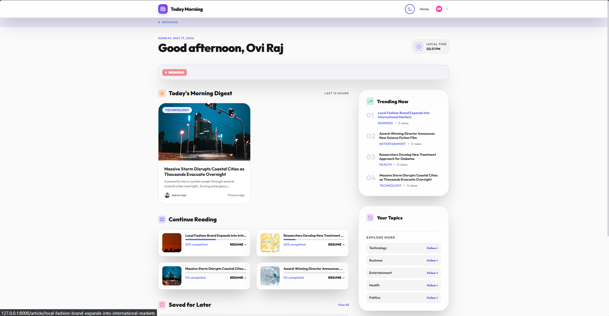
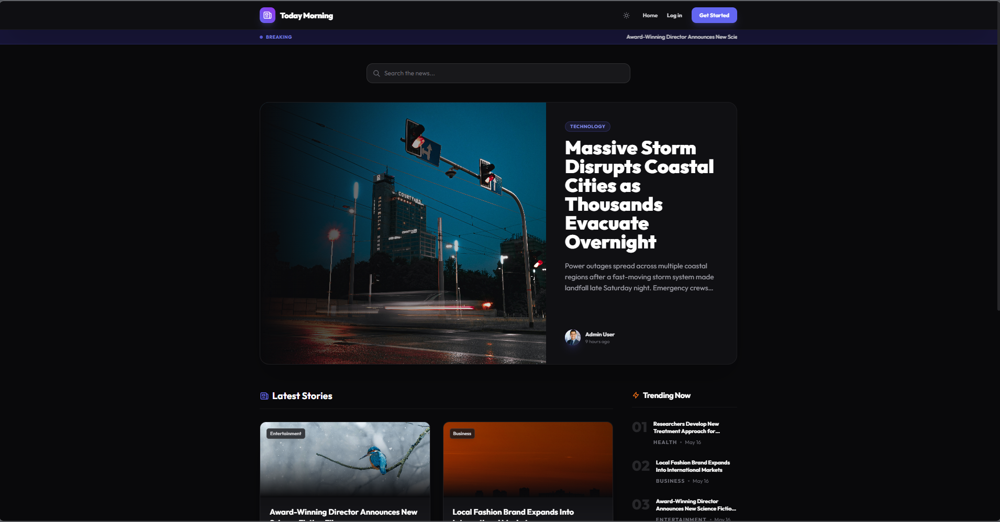

# Today Morning News — Daily Editorial Engine



Today Morning News is a high-performance, enterprise-grade news content management system (CMS) built for modern journalism. Designed with a "Today Morning News" aesthetic, it provides an immersive, glassmorphism-inspired environment for journalists, editors, and administrators.

---

## 🌟 Project Overview

This platform is more than just a blog engine; it's a complete **Editorial Command Center**. It bridges the gap between raw reporting and professional publishing with a focus on speed, visual excellence, and data-driven insights.

### 🎨 Design Philosophy
- **Glassmorphism**: Modern UI with frosted glass effects and subtle depth.
- **Dynamic Interactions**: Powered by Alpine.js for smooth, lag-free transitions.
- **Dark Mode First**: A premium dark-centric experience with a global toggle.
- **Responsive Canvas**: Tailored for both high-resolution newsrooms and mobile field reporting.

---

## 📸 Interface Showcase

### 🖥️ Main Dashboard
An immersive, glassmorphic layout highlighting breaking news, category feeds, and dynamic editorial cards.


### 🌓 Morning Digest (Dark & Light Modes)
A personalized landing area featuring an instant theme switcher for optimal day or night reading.
<p align="center">
  
  
</p>

### 📖 Immersive Reading Canvas
Clean, content-focused reading layouts with a full-width header image and floating interactive elements.


---

## 🚀 Core Modules

### 📝 Professional Editorial Workflow
- **Git-like Versioning**: Automatic and manual snapshots of articles. Compare versions with side-by-side diffs and restore any previous state.
- **Draft Management**: Save progress with intelligent auto-save and workflow status transitions (Draft → Under Review → Published).
- **Editorial Remarks**: Direct feedback loop between editors and journalists.

### 📈 Insights & Analytics
- **Real-Time Tracking**: Throttled view tracking to monitor engagement without performance overhead.
- **Advanced Dashboard**: Visualizations using Chart.js for views, trending topics, and device breakdown.
- **Trending Engine**: Algorithmic sorting of articles based on velocity and recent engagement.

### 💬 Community & Engagement
- **Interactive Comments**: Nested discussions with moderation tools and reporting features.
- **Reactions System**: Emotional engagement through curated reaction sets.
- **Reading Progress**: Real-time tracking of how far users have read into a story.

### 🔔 Intelligence Layer
- **Notification Center**: Grouped notifications for editorial updates, comments, and system alerts.
- **Activity Logging**: Full audit trail of all major system actions.
- **Subscription Management**: Professional subscription engine for reader retention.

---

## 🛠️ Technology Stack

| Layer | Technology |
| :--- | :--- |
| **Backend** | Laravel 11 (PHP 8.2+) |
| **Frontend** | Livewire 3, Alpine.js, Tailwind CSS |
| **Database** | MySQL 8.0 (Optimized with Strategic Indexing) |
| **Visuals** | Chart.js, Lucide Icons, Google Fonts (Outfit) |
| **Tooling** | Vite, PHPUnit, Laravel Pint |

---

## 🔐 Role & Permission Matrix

The system utilizes a granular permission model powered by Spatie Laravel-Permission.

| Role | Core Responsibilities | Key Permissions |
| :--- | :--- | :--- |
| **Admin** | Full system governance | All permissions, User management, Logs |
| **Editor** | Content strategy & quality | Publish, Approve/Reject, Breaking News, Moderate |
| **Journalist** | Content creation & reporting | Create, Edit Own, View Analytics |
| **Moderator** | Community health | Moderate Comments, View Reports |
| **Reader** | Content consumption | Comment, React, Subscribe |

---

## 📦 Installation & Quick Start

### Prerequisites
- PHP 8.2+
- Composer
- Node.js & NPM
- MySQL 8.0+

### Setup Steps
1. **Clone & Install**:
   ```bash
   git clone https://github.com/SAURAAVSARKAR/newspaper.git
   cd newspaper
   composer install && npm install
   ```

2. **Environment**:
   ```bash
   cp .env.example .env
   php artisan key:generate
   ```

3. **Database**: Update `.env` with your credentials, then run:
   ```bash
   php artisan migrate:fresh --seed
   ```

4. **Launch**:
   ```bash
   npm run dev
   # In a separate terminal
   php artisan serve
   ```

### 🔑 Seeded Credentials
| Role | Email | Password |
| :--- | :--- | :--- |
| **Admin** | `admin@newspaper.com` | `password` |

---

## 📂 Project Structure

```text
├── app/
│   ├── Models/          # Rich Domain Models (Article, Version, Analytics)
│   ├── Services/        # Logic Layer (Versioning, Trending, Analytics)
│   ├── Livewire/        # Reactive Frontend Components
│   └── Observers/       # Automation (Auto-versioning, Slugs)
├── resources/
│   ├── views/           # Blade templates with Modern UI patterns
│   └── css/             # Custom Tailwind & Glassmorphism styles
└── database/
    └── seeders/         # Comprehensive development data
```

---

## 📊 Performance & Optimization

- **N+1 Prevention**: All major components use Eager Loading for relationships.
- **SQL Indexing**: Strategic indexes on `status`, `published_at`, `is_featured`, and `viewed_at`.
- **Analytics Aggregation**: Device and hourly statistics are computed directly in SQL to minimize PHP overhead.
- **Throttled Views**: Prevents database spamming while maintaining accurate engagement metrics.

---

## 📄 License

This project is open-sourced software licensed under the [MIT license](LICENSE).

---

Built with ❤️ for Modern Journalism.

