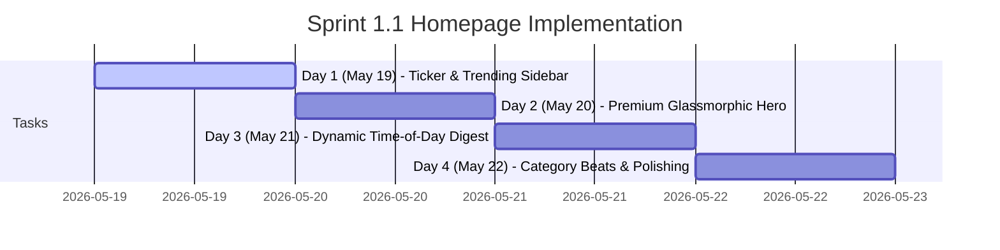

# Sprint 1.1: 4-Day Public Homepage Plan
> Phase 2 · Sprint 1 · Implementation Schedule: May 19 - May 22, 2026

We have broken down **Sprint 1.1: Public Homepage** into a structured **4-Day Plan**. Each day focuses on building a highly polished, premium, and fully-tested component of the public-facing homepage.

---

## 📅 Day-by-Day Schedule

### 🔴 Day 1 — Tuesday, May 19, 2026: Ticker & Real-Time Trending Sidebar
> **Focus**: Live-feeling ticker & high-frequency analytics tracking.

* **Live, Dismissible Breaking News Ticker**:
  - Integrate smooth ticker transition in [BreakingNewsTicker](file:///g:/laravel/Newspaper/app/Livewire/Shared/BreakingNewsTicker.php).
  - Add dismissible `x-data` state with Alpine.js, saving status to `sessionStorage` so it doesn't reappear after navigating away.
  - Implement a glowing red status light next to the "Breaking News" label.
* **Real-Time Trending Sidebar (Last 6 Hours)**:
  - Add query scope `scopeTrendingSixHours` to [Article.php](file:///g:/laravel/Newspaper/app/Models/Article.php) to filter views within the last 6 hours instead of 7 days.
  - Style ranking numbers (`01`, `02`, `03`) with extra large, semi-transparent typography that highlights when hover occurs in [home.blade.php](file:///g:/laravel/Newspaper/resources/views/livewire/public/home.blade.php).
  - **Goal**: Establish the trending list next to the main feed.

### 🏆 Day 2 — Wednesday, May 20, 2026: Immersive Hero Section
> **Focus**: Perfect visual hook & premium aesthetics.

* **Premium Glassmorphic Hero**:
  - Build a gorgeous full-width glassmorphic card for the featured story.
  - Style dynamic category badges, read time, and direct article routing.
  - Implement dynamic zoom animations on the hero image on hover, and slide-in typography on load.
* **Author Card Integrations**:
  - Embed author avatars, names, and release dates with premium hover micro-animations.

### ☀️ Day 3 — Thursday, May 21, 2026: Time-of-Day Morning/Day Digest Section
> **Focus**: Personalization & dynamic time curation.

* **Dynamic Greetings**:
  - Add helper logic in [Home.php](file:///g:/laravel/Newspaper/app/Livewire/Public/Home.php) to capture user local time.
  - Greet the reader contextually:
    - `05:00 - 12:00`: "Good Morning ☀️" (seeds fresh morning reads)
    - `12:00 - 17:00`: "Good Afternoon ☕" (seeds peak afternoon reports)
    - `17:00 - 05:00`: "Good Evening 🌙" (seeds deep-dive nightly features)
  - Display reader names if they are authenticated.
* **Dynamic Time Curation**:
  - Load and render content matching the current time block.

### 📂 Day 4 — Friday, May 22, 2026: Category Beats Blocks & Final Polishing
> **Focus**: Layout hierarchy, dark mode compliance, & final sign-off.

* **Category Beats Blocks**:
  - Construct organized CSS grid layouts for major beats: **Politics, Sports, Tech, and Entertainment**.
  - Query the top 3-4 published articles per category dynamically.
  - Format beat headers with links to view all articles under that category.
* **Comprehensive Testing & Polishing**:
  - Ensure perfect theme integration (Light/Dark transitions) on all new components.
  - Test responsive styling on mobile, tablet, and desktop views.
  - Run database performance optimizations (mitigate N+1 query issues using Laravel eager loading).

---

## 🏁 Definition of Done for Each Day
- **Day 1 (May 19)**: Breaking news can be closed and trending articles query represents views within a 6h window.
- **Day 2 (May 20)**: Hero card render is scroll-free, responsive, and contains rich glassmorphism backdrop-blurs.
- **Day 3 (May 21)**: Greeting block accurately greets users based on system hour and feeds contextually targeted posts.
- **Day 4 (May 22)**: Politics, Sports, Tech, Entertainment rows appear perfectly, dark mode is checked, and N+1 queries are audited.
